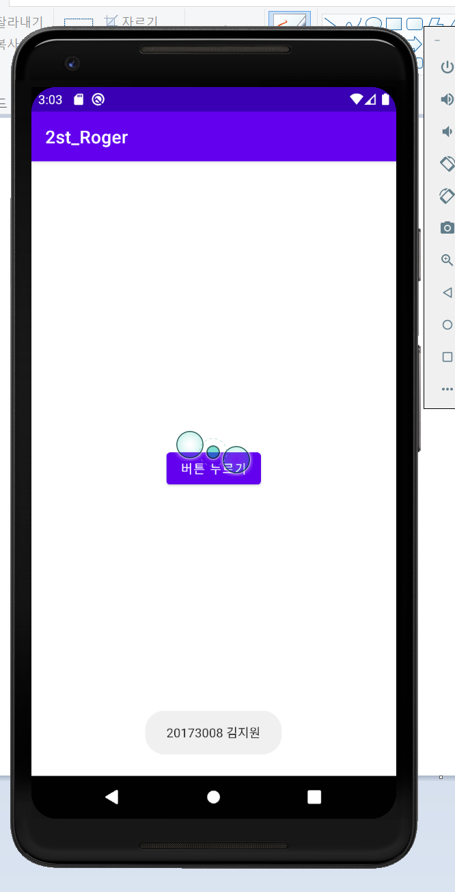
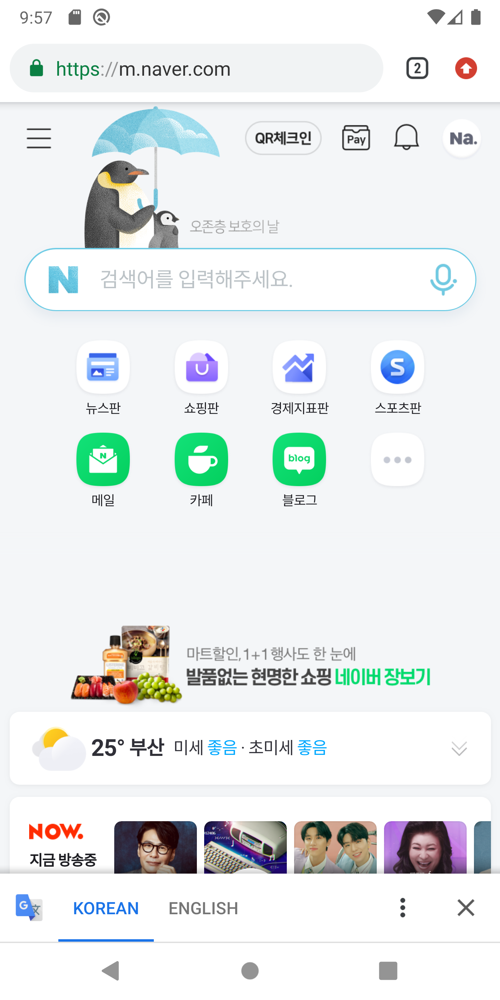
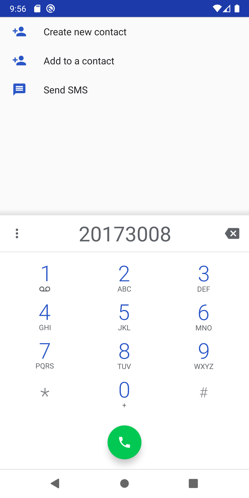
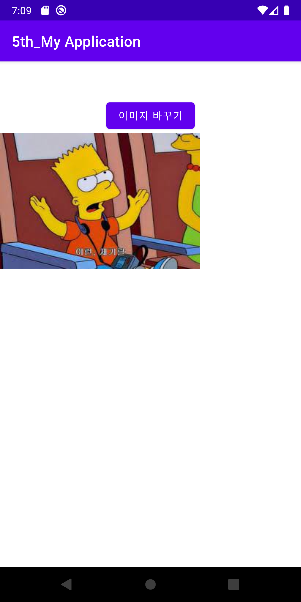
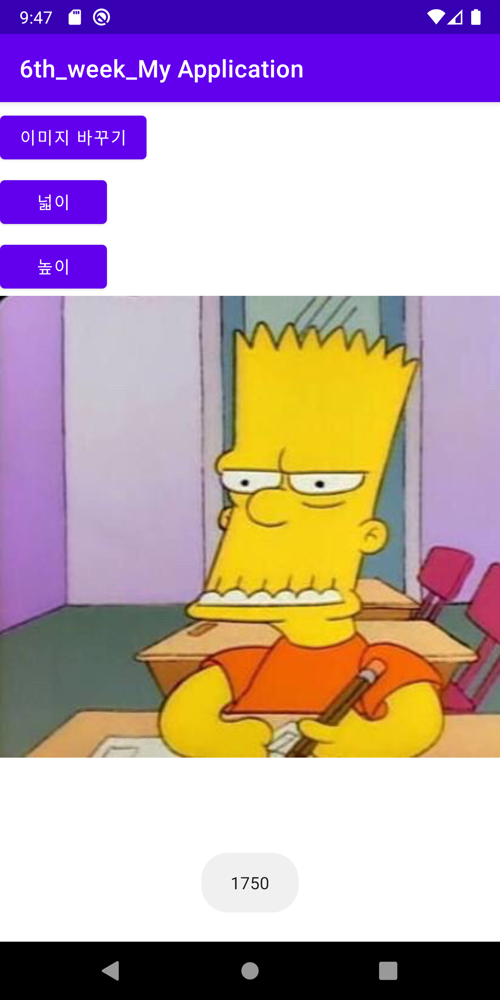
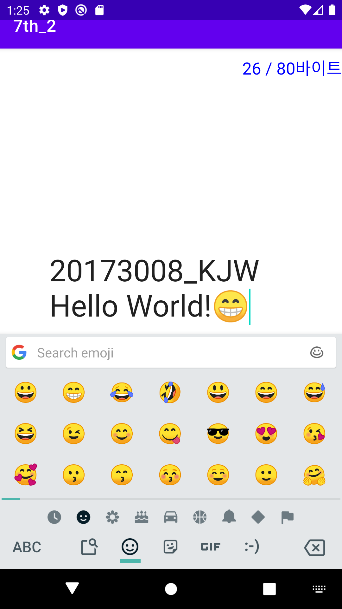

# 20173008_kjw_androidApp

## 1주차

## 2주차
  - Github사용법

</img>

## 3주차
  - 20173008 김지원, 과제제출 합니다

</img>

</img>

## 4주차
  - 20173008 김지원, 과제제출 합니다.

<20173008 김지원 4주차 과제>
주제 : 스피츠(강아지)를 위한 어플
추천단계(?): 강아지를 위 해 무엇을 해야할 지 모르겠다.
강함단계(?): 분류된 카테고리를 정해서 해당되는 카테고리에 들어가 정보 및 도움을 얻는다
강력(?): 분류된 카테고리 내에서 추천하는 N개의 키워드를 선정한다
초강력(?): N개의 키워드 중 가장 적합한 추천 목록 중 몇개의 사진을 제시한다.

기능리스트 : 회원가입,로그인, 검색, 정보수정 etc...
회원가입 시 약관 제시

전체적인 어플의 컨셉 : 심플 및 모
아이콘 및 세부 이미지들은 전체적인 컨셉과 맞물리기 위해 심플 및 모던한 이미지로 구성
단계별 아이콘도 준비할 것 
ex. 
1.
①.
a.
㉠

주의사항 : 스피츠를 위한 어플이지만 해당 범주의 강아지 및 그 외의 종을 위함도 부족함이 없을 것

## 5주차
  - 20173008 김지원, 과제제출 합니다.

</img>

</img>

## 6주차
  - 20173008 김지원, 과제제출 합니다.
  - P.S. 아이콘 정렬은 왼쪽 상단에 배치하는 것이 더 깔끔한 것 같아 옮겨봤습니다.

</img>

</img>

## 7주차
  - 20173008 김지원, 과제제출 합니다.
</img>
